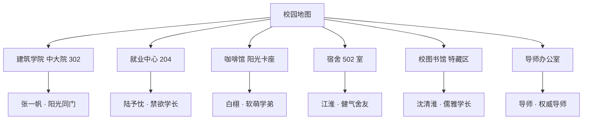

# 我是一个"建"人 (Architecture Career Simulator)

> 一款关于建筑学研究生三年转行生涯的文字养成模拟器。你需要在导师、论文、实习、校招、同门社交与心理状态之间做出取舍，并为自己的选择承担后果。


## 📖 项目简介

《我是一个"建"人》使用高精度数值系统、分支叙事与视觉小说（AVG）互动，沉浸式模拟建筑学研究生的三年求职经历。玩家将经历角色创建、导师选择、学业科研、校园日常、随机事件、实习投递、校园招聘、同门心动攻略、Offer 抉择与终极人生结局。

游戏既包含海量真实考据的预设分支，也接入了 **AI 自由行动**：玩家可以输入自己的独特做法，由大语言模型结合当前情境与属性动态推演后续剧情与数值影响。

---

## ✨ 核心特色与系统矩阵

| 模块 | 核心内容 |
| :--- | :--- |
| **三年养成** | 6 个学期、24 个主要回合，在学业、能力、金钱、人际与心理健康之间合理规划时间 |
| **属性矩阵** | **28 项细分属性**（9 专业硬实力 + 9 综合软实力 + 10 状态与资源），覆盖专业力、逻辑、表达、抗压、储蓄、导师认可度、数据分析、商业嗅觉等 |
| **AVG 角色系统** | **5 位可攻略 NPC**（同门 / 学长 / 学弟 / 舍友）+ **导师**，配备专属高清立绘、**仿生微呼吸动效**、多轮视觉小说对话 |
| **专属心动攻略** | 研习互助 + 私密心动双轨互动，支持 4~5 阶好感解锁递进（`牵手`、`拥抱`、`接吻`、`求婚`），更有荒谬有趣的**导师攻略线** |
| **日常情境寒暄** | 每次拜访 NPC 均自动随机触发专属日常对话；电脑端微信支持对话树抉择、快捷消息与自由输入，好感变化实时内嵌展示 |
| **微信全双工同步** | 校园地图线下拜访与电脑端「微信社交系统」的好感度、解锁状态与聊天记录全双工实时同步 |
| **分支事件** | **81 条随机事件**（覆盖 `e01` ~ `e90` 号大类剧情，其中 79 条含深度分支），每条含 3-4 个预设选择，选择前隐藏影响，结算后展示详细数值变动 |
| **多伴侣修罗场** | 同时与多位角色确立关系后触发专属修罗场事件（工位甜品撞车、图书馆战略对决、宿舍领地危机、导师组会公审），含属性门槛选项与连锁好感代价 |
| **立绘点击互动** | 点击 AVG 立绘任意位置触发涟漪动画与角色即兴回应，台词随关系阶段与点击区域变化，气泡位置按立绘构图逐角色配置 |
| **NPC 全语音** | **257 条语音资源**覆盖初遇、表白、研习/心动互动、导师面谈与送礼等核心场景 |
| **成就系统** | **48 项成就**记录三年养成生涯的关键节点与隐藏彩蛋 |
| **AI 自由行动** | 每个分支事件均支持自由输入行动文本，由大模型智能判定合理性并推演剧情走向与属性浮动 |
| **导师办公室** | **4 类导师**（学术派 / 放养派 / 实践派 / 海归派），含送礼拒收判定、组会汇报、实习请假与禁忌心动 |
| **实习与校招** | **69 个实习岗位** + **54 家校招企业**（互联网大厂 / 外企科技 / 战略咨询 / 智能车企 / 量化投行 / 传统设计院等） |
| **天赋 Perk** | **10 大职业天赋**（空间产品经理 / 咨询脑 / 设计复合体 / AI PM …），达标自动解锁并附带专属加成 |
| **经济系统** | **10 大城市差异化生活成本**，按实习/就业城市动态结算房租、生活费、劳务报酬与奖学金账单 |
| **多重结局** | **14 种人生结局**，支持生成并下载精美高清结局长图，接入全服结局分布统计 |
| **存档与助手** | 本地自动保存 + **3 个手动存档槽**；内置「大轩 AI 军师」，随时提供游戏攻略与现实转行答疑 |

---

## 👥 NPC 人物档案与常驻地点

游戏中拥有 5 位各具魅力的人物与导师，均可在校园地图中探索初遇并展开深层互动：



1. **张一帆（建筑学院 · 中大院 302 工位）**
   - **身份标签**：专硕同门 · 清爽阳光 · 建模鬼才 · 甜系搭子
   - **专属互动**：探讨方案、吐槽导师、大厂模面、调试电池、牵手、拥抱、亲脸颊、接吻。
2. **陆予忱（就业中心 · 204 职业指导室）**
   - **身份标签**：专硕学长 · 禁欲系 Hot Nerd · 逻辑破局者 · 极品骨相
   - **专属互动**：拆解案例、修改简历、剖析课题、探讨 AI、牵手、拥抱、接吻、求婚。
3. **白栩（咖啡馆 · 阳光卡座）**
   - **身份标签**：专硕学弟 · 软萌正太 · 年下小狗 · 治愈陪伴
   - **专属互动**：指导快题、拼装模型、听他吐槽、交换素材、擦嘴角、撑伞拥抱、接吻、求婚。
4. **江淮（宿舍 · 502 室）**
   - **身份标签**：体育生舍友 · 健气阳光 · 纯情大狼狗 · 力量担当
   - **专属互动**：打羽毛球、请教力学、吃烤冷面、晨跑拉伸、牵手、拥抱、接吻、求婚。
5. **沈清淮（校图书馆 · 古籍特藏区）**
   - **身份标签**：专硕学长 · 温润儒雅 · 手绘速写大师 · 治愈白月光
   - **专属互动**：手绘速写、借阅古籍、文献断代、自习陪伴、牵手、拥抱、接吻、求婚。
6. **导师办公室（中大院 4 楼）**
   - **身份标签**：课题组大老板 · 建筑学界学术权威
   - **专属互动**：学术请教、修改大纲、实习请假、赠送心意礼品，以及专属【禁忌心动 · 导师攻略】（`送拉花咖啡`、`牵手`、`拥抱`、`接吻`、`求婚`）。

---

## 🎮 游戏核心玩法循环

```text
角色创建 → 选择导师 → [ 每学期 4 回合，共 24 回合 ]
                           ↓
    ┌──────────────────────┼──────────────────────┐
    ↓                      ↓                      ↓
校园探索 & 拜访       日常学业/技能行动         分支随机事件
(5位NPC+导师AVG)      (17项成长行动)         (81条随机事件 / AI自由行动)
    └──────────────────────┬──────────────────────┘
                           ↓
                    数值结算 + 月度账单
                           ↓
                 实习雷达投递 → 面试筛选 → Offer
                           ↓
                 秋招大拜年 → 14 种人生结局
```

---

## 🛠️ 快速开始

### 运行环境
- **Node.js**: 20.0 或更高版本
- **包管理器**: npm

### 本地启动与开发
```bash
# 1. 克隆仓库
git clone https://github.com/caoyuxuan200205-sketch/Future-architect.git
cd Future-architect

# 2. 安装依赖
npm install

# 3. 启动本地开发服务器
npm run dev
```
启动后终端将显示本地访问链接（如 `http://localhost:5173/`）。

### 生产打包构建
```bash
npm run build
```
打包输出产物位于 `dist/` 目录，可直接用于部署上线。

---

## 🤖 配置 AI 自由行动与军师

进入游戏后，点击右下角的 **「大轩 AI 军师」** 齿轮图标，即可在设置面板中填入你的 **ModelScope (魔搭) API Key**。

也可通过在项目根目录创建 `.env` 文件进行配置：

```env
VITE_QWEN_API_KEY=你的_ModelScope_API_Key
VITE_QWEN_MODEL=Qwen/Qwen3.5-35B-A3B
VITE_QWEN_BASE_URL=https://api-inference.modelscope.cn/v1
```

> **安全提示**：API Key 仅保存在玩家本地浏览器的 `localStorage` 中，直接由前端向模型端发起请求。公开部署时请勿将私有高权限密钥提交至代码仓库。

---

## ☁️ 配置 Supabase（可选）

不配置 Supabase 时单机版所有功能依然完整可用。Supabase 主要用于**全服结局统计图表**与**现实转行向量知识库（RAG）检索**。

配置方式（在 `.env` 中）：
```env
VITE_SUPABASE_URL=你的_Supabase_URL
VITE_SUPABASE_ANON_KEY=你的_Supabase_Anon_Key
```

相关数据库定义文件：
- [`supabase_schema.sql`](supabase_schema.sql)：pgvector 知识库表结构与向量匹配函数；
- [`scripts/supabase-ending-distribution.sql`](scripts/supabase-ending-distribution.sql)：全服结局与 Offer 聚合统计脚本。

---

## 📂 项目工程结构

```text
.
├─ public/
│  ├─ characters/                     # 5 大角色高清专属人物立绘
│  ├─ assets/visuals/                 # 地图、学校、导师、公司、结局等美术资源
│  └─ assets/audio/                   # NPC 语音音频资源（257 条）
├─ scripts/                           # Supabase 导入与工具脚本
├─ src/
│  ├─ main.tsx                        # 应用入口
│  ├─ styles/
│  │  └─ theme.css                    # 全局视觉主题、AVG 呼吸微动与立绘点击涟漪动画
│  ├─ app/
│  │  ├─ App.tsx                      # 根应用容器
│  │  ├─ eventMeta.ts                 # 随机事件元数据与因果抽取算法
│  │  ├─ eventBranches.ts             # 79 条随机事件分支逻辑（e01–e90）
│  │  ├─ components/
│  │  │  ├─ GamePage.tsx              # 游戏主逻辑与核心循环状态机
│  │  │  ├─ PeerVisitModal.tsx        # 5 大同门/学长/舍友 AVG 视觉小说拜访弹窗
│  │  │  ├─ MentorOfficeModal.tsx     # 导师办公室面谈、送礼与攻略弹窗
│  │  │  ├─ PortraitClickLayer.tsx    # 立绘点击互动层（涟漪动画 + 即兴台词气泡）
│  │  │  ├─ DetailedStatsPanel.tsx    # 28 项能力雷达矩阵与 Perk 勋章面板
│  │  │  ├─ DesktopGameSidebar.tsx    # 桌面端侧边导航、地图与微信社交面板
│  │  │  ├─ AIAssistant.tsx           # 大轩 AI 军师悬浮窗
│  │  │  ├─ MonthlyBillModal.tsx      # 月度账单与财务收支弹窗
│  │  │  └─ mobile/MobileGameShell.tsx# 移动端适配外壳与地图抽屉
│  │  ├─ economy/finance.ts           # 10 城生活成本与经济模型
│  │  ├─ npc/
│  │  │  ├─ peerData.ts               # 5 大 NPC 人设档案、日常寒暄、心动对话与点击台词池
│  │  │  ├─ mentorEncounterData.ts    # 导师人设、拒收概率与攻略剧情
│  │  │  ├─ dialogueTrees.ts          # 微信对话树注册表（解锁/回合/好感里程碑触发）
│  │  │  ├─ npcRegistry.ts            # 全局 NPC 注册表
│  │  │  ├─ socialStore.ts            # 好感度结算、对话树引擎与微信聊天存储
│  │  │  └─ types.ts                  # NPC 社交系统类型定义
│  │  ├─ achievements/                # 48 项成就定义
│  │  ├─ thesis/thesisScore.ts        # 毕业论文估分与开题预警
│  │  ├─ services/
│  │  │  ├─ tracker.ts                # 埋点与结局分享统计
│  │  │  └─ voiceManager.ts           # NPC 语音调度
│  │  ├─ perks/perkRegistry.ts        # 10 大职业天赋定义
│  │  └─ lib/
│  │     ├─ llm.ts                    # LLM 客户端与自由行动接口
│  │     ├─ knowledgeBase.ts          # RAG 知识检索逻辑
│  │     └─ supabase.ts               # Supabase 客户端实例
├─ supabase_schema.sql                # 数据库架构定义
├─ vite.config.ts                     # Vite 构建配置
└─ .github/workflows/deploy.yml       # GitHub Actions 自动部署流水线
```

---

## 🚀 部署到 GitHub Pages

项目已内置 GitHub Actions 自动构建与部署工作流 [`.github/workflows/deploy.yml`](.github/workflows/deploy.yml)。只要向 `main` 分支提交代码，即可自动触发部署。

首次启用步骤：
1. 访问 GitHub 仓库的 **Settings → Pages**；
2. 在 **Build and deployment → Source** 中选择 **GitHub Actions**；
3. 提交代码至 `main`，等待 Workflow 运行完成即可通过 Pages 链接在线游玩！

---

## 🏛️ 致敬与声明

- 导师角色名均重组自建筑学界院士级大师学者（如“齐廷宝” = 齐康 × 杨廷宝、“童敦桢” = 童寯 × 刘敦桢），仅作学术致敬与艺术创作使用，不映射任何现实具体人物。向所有在建筑学术与设计一线耕耘坚守的前辈学者致以最高敬意！
- 游戏纯属虚构，转行与职业抉择剧情旨在以诙谐温情的方式呈现当代青年学子的成长探索。
